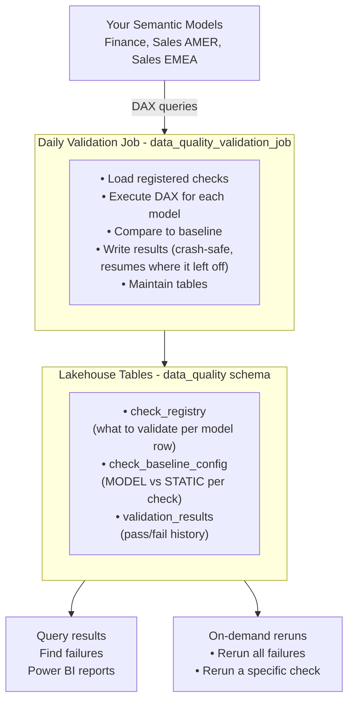
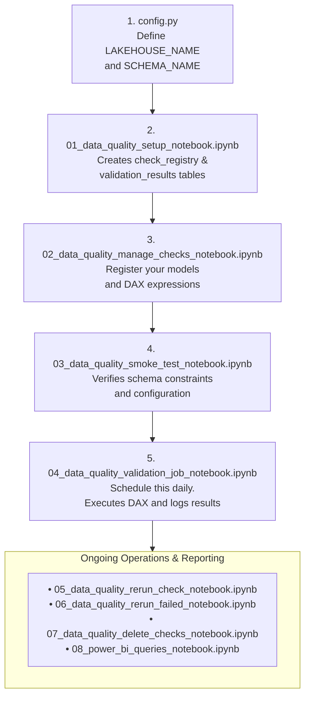
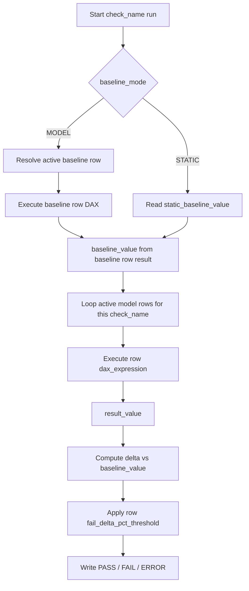

# Data Quality Validation System

Monitor semantic model consistency across your Fabric workspace. This system validates that the same metrics return the same values across multiple models, and alerts you when they diverge.

## Problem Solved

You manage 100+ reports across multiple semantic models. The same metric (e.g., "Total Sales") may be named differently in each model (`[Sales Amount]`, `[Total Revenue]`, `[Net Sales]`). You need daily validation that all models tie, even with these name differences.

Instead of manually comparing values, this system:
- Registers which DAX expression calculates each metric in each model
- Runs them daily and compares results
- Stores pass/fail history in a table
- Allows crash recovery and multiple runs per day

## System Overview



---

## Setup & Execution Flow



---

## Getting Started (5 minutes)

### Quick Setup Checklist (Business Analyst)

Use this checklist for first-time setup:

1. Confirm you can open the target workspace and semantic models in Fabric.
2. Upload `config.py` to your Fabric Lakehouse at `/Files/code/config.py` and update LAKEHOUSE_NAME / SCHEMA_NAME.
3. Run `01_data_quality_setup_notebook.ipynb` once.
4. Run `02_data_quality_manage_checks_notebook.ipynb` and add 1-2 pilot checks first.
5. Run `03_data_quality_smoke_test_notebook.ipynb` and ensure it passes.
6. Run `04_data_quality_validation_job_notebook.ipynb` manually and verify rows are written to `validation_results`.
7. Only after pilot success, add your full check list and schedule the daily job.

This reduces production risk and catches DAX/model access issues early.

### 1. Run Setup (One-Time)

Before running, configure your environment:

1. Upload `config.py` to Fabric Lakehouse at `/Files/code/config.py`
2. Edit `config.py` and update `LAKEHOUSE_NAME` and `SCHEMA_NAME` with your actual values
3. Open **`01_data_quality_setup_notebook.ipynb`** in Fabric and **Run All** — creates required tables: `check_registry`, `check_baseline_config`, and `validation_results`

✓ Done. Your tables are ready.

### 2. Register Your First Checks

Open **`02_data_quality_manage_checks_notebook.ipynb`**:

1. Confirm `config.py` values are correct (LAKEHOUSE_NAME, SCHEMA_NAME)
2. Find the `checks = [...]` list (around line 20)
3. Add one row per model per metric:

```python
checks = [
  # (check_name,         model_name,       workspace_id,                           dataset_id,                             workspace_name,       dataset_name,         dax_expression,                            run_frequency,    fail_delta_pct_threshold)
  ("Total Sales",        "Finance",        "11111111-2222-3333-4444-555555555555", "aaaaaaaa-bbbb-cccc-dddd-eeeeeeeeeeee", "Finance WS",         "Finance Model",      'EVALUATE ROW("value", [Sales Amount])',  "ONCE_PER_DAY",  0.10),
  ("Total Sales",        "Sales AMER",     "66666666-7777-8888-9999-000000000000", "ffffffff-1111-2222-3333-444444444444", "Sales WS",           "Sales AMER Model",   'EVALUATE ROW("value", [Total Revenue])',"ONCE_PER_DAY",  0.25),
  ("Total Sales",        "Sales EMEA",     "66666666-7777-8888-9999-000000000000", "55555555-6666-7777-8888-999999999999", "Sales WS",           "Sales EMEA Model",   'EVALUATE ROW("value", [Net Sales])',    "ONCE_PER_DAY",  0.25),
]
```

**Key Rules:**
- **check_name** must be identical across all models for that metric (e.g., "Total Sales")
- **workspace_id** and **dataset_id** are required for every row (use GUIDs, not display names)
- The unique identity of a model row is `(check_name, workspace_id, dataset_id)`; `model_name` is a display label and can change.
- **DAX expression** must return a **single number**, e.g. `EVALUATE ROW("value", [Sales Amount])`
- **run_frequency**:
  - `"ONCE_PER_DAY"` (default) — check runs max once per calendar day
  - `"MULTIPLE_PER_DAY"` — can execute this check multiple times per day
- **fail_delta_pct_threshold** is required on every row you add and can vary across rows inside the same `check_name`
- Baseline behavior is configured per `check_name` in `check_baseline_config`:
  - `MODEL` uses the row where `is_baseline = true`
  - `STATIC` uses `static_baseline_value`

4. **Run All** — checks are registered

✓ You now have 3 checks registered.

### 3. Run the Daily Job (Manually or Scheduled)

Open **`04_data_quality_validation_job_notebook.ipynb`**:

1. Confirm `config.py` values are correct
2. **Run All**

The job will:
- Load your checks from `check_registry`
- Execute each DAX expression
- Compare all models to their baseline
- Write results to `validation_results` with PASS/FAIL/ERROR status
- Show failures at the end
- Automatically maintain (optimize, vacuum, analyze) the tables

✓ Results are in the table.

**To Schedule Daily:**
In Fabric, create a Job Scheduler → select this notebook → set to run daily at your preferred time.

---

## Notebooks Reference

### `01_data_quality_setup_notebook.ipynb`
**Purpose:** One-time initialization  
**When to run:** Once when you first set up the system  
**What it does:**
- Creates the `data_quality` schema
- Creates `check_registry` table (where you put your checks)
- Creates `validation_results` table (where results are stored)

**Config:**
```python
LAKEHOUSE_NAME = "MyLakehouse"   # Your existing Lakehouse
SCHEMA_NAME    = "data_quality"  # New schema to create
```

This notebook imports config from `config.py` (with fallback defaults).

---

### `config.py`
**Purpose:** Shared configuration file for all operational notebooks  
**Where to place:** Upload to Fabric Lakehouse at `/Files/code/config.py`  
**When to update:** Edit values whenever environment settings change  
**What it contains:**
- `LAKEHOUSE_NAME`: Your existing Fabric Lakehouse (e.g., "MyLakehouse")
- `SCHEMA_NAME`: Schema where data quality tables are created (e.g., "data_quality")
- `MAX_RETRY_ATTEMPTS`, `INITIAL_RETRY_DELAY`, `DAX_TIMEOUT_SECONDS`: Retry/timeout settings for DAX execution
- `RUN_TABLE_MAINTENANCE`, `MAINTENANCE_DAY_UTC`: Maintenance behavior flags

Row-level fail thresholds are not stored here. They are stored in `check_registry.fail_delta_pct_threshold`.

---

### `02_data_quality_manage_checks_notebook.ipynb`
**Purpose:** Register checks in bulk  
**When to run:** Anytime you want to add, change, or enable checks  
**What it does:**
- Edit the `checks = [...]` list with your model names and DAX expressions
- UPSERT them into `check_registry` (safe to re-run — won't create duplicates)
- Uses `(check_name, workspace_id, dataset_id)` as the row identity key
- When an active row's model metadata, DAX, frequency, or threshold changes, the prior active row is soft-retired and a new active version is inserted
- Enforce that each `check_name` uses exactly one `run_frequency` across all models
- Show you what's registered

**Key Column:** `run_frequency`
- `"ONCE_PER_DAY"` — skips if already ran today
- `"MULTIPLE_PER_DAY"` — allows multiple runs per day

**Safe to re-run anytime** — it updates control flags in place, versions substantive row changes by retiring the prior active row, and validates `run_frequency` consistency per active `check_name`.

Production hardening in this notebook:
- Fail-fast validation for blank required fields
- Fail-fast enum validation for `run_frequency`
- Submission duplicate-key validation
- Concurrency-aware MERGE retries with post-merge integrity check

For targeted edits to existing rows, use `02_data_quality_manage_checks_notebook.ipynb`.

---

### `02_data_quality_manage_checks_notebook.ipynb`
**Purpose:** Update existing checks by identity selector  
**When to run:** When you need to modify DAX, display names, run frequency, or active flag for specific rows  
**What it does:**
- Loads current rows from `check_registry`
- Applies identity-safe updates using `(check_name, workspace_id, dataset_id)`
- Retires the prior active row and inserts a new active version when row content changes
- Allows partial updates (leave a field as `None` to keep existing value)
- Validates selectors, allowed `run_frequency` values, and post-update frequency consistency

**Typical use cases:**
- Adjust one model's DAX expression without editing your full add list
- Rename `model_name` / `workspace_name` / `dataset_name` labels
- Change one check from `ONCE_PER_DAY` to `MULTIPLE_PER_DAY`
- Reactivate or deactivate specific identity rows

---

### `07_data_quality_delete_checks_notebook.ipynb`
**Purpose:** Manage (deactivate or delete) checks  
**When to run:** When you want to stop validating a check  
**What it does:**
- Shows all registered checks
- Lets you soft-delete (set `is_active = false`) or hard-delete (remove permanently)
- Supports deleting one exact model identity row by `check_name + workspace_id + dataset_id`
- Shows remaining active checks

**Options:**
```python
DELETE_METHOD = "soft"  # "soft" (is_active=false) or "hard" (permanent delete)

# Selector format in to_delete:
# (check_name, workspace_id_or_None, dataset_id_or_None)
# If IDs are None, all rows for that check_name are targeted.
```

**Soft delete is safer** — keeps historical data but won't run in future jobs.

---

### `04_data_quality_validation_job_notebook.ipynb`
**Purpose:** Daily validation execution  
**When to run:** Every day (schedule in Fabric Job Scheduler)  
**What it does:**
1. Loads all active checks from `check_registry`
2. Skips checks that already ran today (if `run_frequency = "ONCE_PER_DAY"`)
3. Executes each DAX expression for each model
4. Resolves the baseline from `check_baseline_config`:
   - `MODEL` compares to the active row where `is_baseline = true`
   - `STATIC` compares to `static_baseline_value`
5. Applies the row's `fail_delta_pct_threshold`
6. Writes PASS/FAIL/ERROR to `validation_results`
7. Shows summary of failures
8. Optimizes tables (consolidates small files, removes old versions, computes stats)

**Key Features:**
- **Crash-safe:** If it fails partway, re-run it and it resumes safely
- **Idempotent per run:** Batch writes use `MERGE` keyed by `(run_id, check_name, workspace_id, dataset_id)` to avoid duplicate rows for the same run
- **Timeout-guarded DAX:** Each DAX call uses best-effort timeout handling to reduce hanging-job risk
- **Batched writes:** Results are written in batches for better performance at scale
- **Scheduled maintenance:** OPTIMIZE, VACUUM, ANALYZE run only when enabled or on the configured maintenance weekday

**Error Handling:**
- Bad DAX expressions → captured as ERROR status with error message
- Empty results → ERROR with "DAX returned empty result"
- Execution continues on errors (doesn't stop the whole job)

Configuration for this job is also read from `config.py`.

---

### `03_data_quality_smoke_test_notebook.ipynb`
**Purpose:** Pre-production and post-change validation gate  
**When to run:** Before enabling schedules, and after schema/code changes  
**What it does:**
- Verifies all three required tables exist
- Verifies required columns exist in `check_registry`, `check_baseline_config`, and `validation_results`
- Verifies no duplicate identity keys in `check_registry`
- Verifies active rows contain required IDs/names, valid `run_frequency`, and valid `fail_delta_pct_threshold`

If any contract fails, the notebook raises an error and should block promotion/scheduling.

---

### `06_data_quality_rerun_failed_notebook.ipynb`
**Purpose:** Rerun checks that failed or errored in a previous run  
**When to run:** After a validation job run that has FAIL or ERROR results  
**What it does:**
- Looks up all `FAIL` / `ERROR` rows for a target date (defaults to today)
- Re-executes the DAX for each failed check
- Writes new results with a fresh `run_id` — original failure rows are preserved for audit history
- Shows a results table for the new run

**Config:**
```python
TARGET_DATE = None  # None = today, or set to "2026-03-21" for a specific date
```

---

### `05_data_quality_rerun_check_notebook.ipynb`
**Purpose:** Rerun a specific check on demand  
**When to run:** Anytime you want to force a check to run, regardless of `run_frequency` or whether it ran today  
**What it does:**
1. Lists all active checks so you can see what's registered
2. Prompts you for `check_name` and optionally `model_name + dataset_name (+ workspace_name when needed)`
3. Resolves `workspace_id/dataset_id` from registry for identity-safe execution
4. Executes the DAX and writes new results with a fresh `run_id`

**Configurable via Parameters:** Set `CHECK_NAME` and optional targets directly in the parameter cell at the top of the notebook. This makes the notebook natively compatible with Fabric Pipelines for automated targeted reruns.

Identity note:
- If you provide `MODEL_NAME`, you must also provide `DATASET_NAME` so the notebook can resolve stable IDs.
- If `MODEL_NAME + DATASET_NAME` still maps to multiple rows, provide `WORKSPACE_NAME` to disambiguate.

---

### `08_power_bi_queries_notebook.ipynb`
**Purpose:** Sample SQL queries for Power BI analytics  
**When to use:** When building dashboards in Power BI Desktop  
**What it contains:**
- **Dimension tables:** Models, Checks, Calendar dates, Model roles
- **Fact tables:** All validation results, failures only, daily trends with pass rates
- **Power BI setup guide:** Connection steps, relationship mapping, visualization suggestions

**Included Queries:**
- `Dim_Models` — List all active models
- `Dim_Checks` — List all registered checks with model counts
- `Dim_Date` — Calendar dimension with year/month/day-of-week
- `Dim_ModelRoles` — Role of each model in fact rows (Baseline vs Comparison)
- `Fact_ValidationResults` — All results with computed flags (is_pass, is_fail, is_error, abs_delta_pct) and the row-level fail threshold used
- `Fact_Failures` — Subset of results where status = FAIL or ERROR, including the row-level fail threshold used
- `Fact_Trends` — Daily aggregated results: pass_count, fail_count, error_count, pass_rate_pct

**How to use:**
1. Open the notebook in Fabric
2. Copy any SQL query that interests you
3. Paste into Power BI Desktop → New Source → SQL
4. Load the data and create relationships based on `check_name` and `run_date`
5. Build dashboards with cards (pass rate %), tables (failures), trends (line charts)

**Sample Visualizations:**
- Health Dashboard: Pass rate % card, trend line by date
- Failure Detail: Table of failed checks with delta values
- Model Comparison: Matrix of checks × models
- Trend Analysis: Pass rate over time, sliced by check or model

---

## Querying Results

Once the validation job runs, results are in `validation_results`. You can query them in a notebook:

### View Today's Results
```sql
SELECT check_name, model_name, result_value, baseline_value, delta_pct, fail_delta_pct_threshold, status
FROM MyLakehouse.data_quality.validation_results
WHERE run_date = CAST(CURRENT_DATE() AS DATE)
ORDER BY check_name, model_name
```

### View Failures Only
```sql
SELECT check_name, model_name, result_value, baseline_value, delta_pct, fail_delta_pct_threshold, status, error_message
FROM MyLakehouse.data_quality.validation_results
WHERE run_date = CAST(CURRENT_DATE() AS DATE) AND status != 'PASS'
```

### View Trend (Last 7 Days)
```sql
SELECT check_name, model_name, run_date, status, result_value, baseline_value, delta_pct
FROM MyLakehouse.data_quality.validation_results
WHERE run_date >= CURRENT_DATE() - INTERVAL 7 DAYS
ORDER BY check_name, model_name, run_date DESC
```

### View a Specific Run
```sql
SELECT * FROM MyLakehouse.data_quality.validation_results
WHERE run_id = '12345678-abcd-1234-abcd-1234567890ab'
```

---

## How It Works

### Comparison Logic

1. **Baseline:** For each `check_name`, the baseline comes from `check_baseline_config`.
   - `MODEL` mode compares against the active row where `is_baseline = true`
   - `STATIC` mode compares against `static_baseline_value`

### Baseline Mode Behavior (Execution)

This is the key distinction:

- In **both** modes, each active model row still executes its own `dax_expression` to produce `result_value`.
- `MODEL` mode uses one active baseline row (`is_baseline = true`) and executes that baseline row's DAX to get `baseline_value`.
- `STATIC` mode does **not** execute a baseline model DAX. It uses `static_baseline_value` directly as `baseline_value`.
- If you add another model row under the same `check_name`, that row is also evaluated and compared to the same baseline (model-based or static, depending on mode).



### Notes

- `STATIC` means "static baseline", not "skip row evaluation".
- If a row has no valid `dax_expression`, the system cannot compute `result_value` for that row and will produce `ERROR`.
- `fail_delta_pct_threshold` is a percent value: `0.30` means `0.30%`, while `30.0` means `30%`.

2. **Delta Calculation:**
   ```text
   absolute_delta = result_value - baseline_value
   relative_pct   = (absolute_delta / baseline_value) * 100
   ```

3. **Pass/Fail Threshold:**
   - PASS: `|relative_pct| <= fail_delta_pct_threshold` for that specific `(check_name, workspace_id, dataset_id)` row
   - FAIL: `|relative_pct| > fail_delta_pct_threshold` for that specific row
   - ERROR: DAX expression threw an exception, returned empty, or baseline resolution failed

### Crash Recovery

If the job crashes partway:

```
Run started... 
  ✓ Check A (Finance)
  ✓ Check A (Sales AMER)
  ✓ Check B (Finance)
  ✗ Connection timeout
```

Just re-run the job. It will:
1. Check what already ran today (by comparing `run_date`)
2. Skip checks with `ONCE_PER_DAY` that already have results
3. Continue with remaining checks and complete the run

### Multiple Runs Per Day

If you set a check to `MULTIPLE_PER_DAY`, the job **won't skip it** on re-runs. This is useful for:
- Real-time metrics (e.g., orders processed)
- Testing (validating models multiple times while changing them)
- High-frequency validation (multiple runs per day on a schedule)

---

## Configuration Reference

### check_registry Columns

| Column | Type | Required | Example | Notes |
|--------|------|----------|---------|-------|
| check_name | STRING | ✓ | "Total Sales" | Must be identical across all models for that metric |
| model_name | STRING | ✓ | "Finance GAAP" | Your label for this model |
| workspace_id | STRING | ✓ | "11111111-2222-3333-4444-555555555555" | Fabric workspace GUID for stable identity |
| dataset_id | STRING | ✓ | "aaaaaaaa-bbbb-cccc-dddd-eeeeeeeeeeee" | Semantic model GUID for stable identity |
| workspace_name | STRING | ✓ | "Finance Workspace" | Fabric workspace name |
| dataset_name | STRING | ✓ | "Finance Model" | Semantic model name |
| dax_expression | STRING | ✓ | `EVALUATE ROW("value", [Sales Amount])` | Must return single number |
| run_frequency | STRING | ✓ | "ONCE_PER_DAY" | "ONCE_PER_DAY" or "MULTIPLE_PER_DAY" |
| fail_delta_pct_threshold | DOUBLE | ✓ | 0.5 | Row-level percent threshold. Example: 0.5 means fail when `|delta_pct| > 0.5` |
| is_active | BOOLEAN | ✓ | true | Set to false to skip without deleting |

### validation_results Columns

| Column | Type | Purpose |
|--------|------|---------|
| run_id | STRING | UUID identifying this run (for crash recovery) |
| run_date | DATE | Calendar date (partition key) |
| run_timestamp | TIMESTAMP | Exact time of execution |
| check_name | STRING | The metric being validated |
| model_name | STRING | Which model this result is for |
| workspace_id | STRING | Workspace GUID copied from registry for stable joins |
| dataset_id | STRING | Dataset GUID copied from registry for stable joins |
| workspace_name | STRING | Workspace display name copied from registry |
| dataset_name | STRING | Dataset display name copied from registry |
| result_value | DOUBLE | The DAX result for this model |
| baseline_model | STRING | Name of the baseline model |
| baseline_value | DOUBLE | The DAX result for baseline |
| absolute_delta | DOUBLE | result_value - baseline_value |
| delta_pct | DOUBLE | (absolute_delta / baseline_value) × 100 |
| fail_delta_pct_threshold | DOUBLE | Threshold copied from `check_registry` for the row execution |
| status | STRING | PASS / FAIL / ERROR |
| error_message | STRING | Exception message if ERROR |

---

## Troubleshooting

### Preflight Connectivity Warning Appears
- This means the DAX executor could not reach the semantic model.
- Execution safely uses `workspace_id` and `dataset_id` to connect natively, avoiding name collision issues. Verify these GUIDs in the `check_registry` are correct.
- Open the semantic model in Fabric and confirm it still exists and is accessible.
- Confirm the exact names in `check_registry` match Fabric names (including spaces/case).
- Re-run the job; unreachable models will produce `ERROR` rows with details.

### DAX Timed Out
- Look for `DAX execution timed out` in `error_message`.
- Execution timeouts are strictly enforced via background threads to prevent the notebook from hanging.
- This usually means the DAX expression is expensive or the model is under load.
- Test the DAX directly in the semantic model and optimize measures if needed.
- If required, increase timeout in notebook config (`DAX_TIMEOUT_SECONDS`) after validation.

### Job Fails with "Bad DAX Expression"
- Check the error message in `validation_results` table (`error_message` column)
- Verify the DAX works in Power BI or Analysis Services directly
- Common issue: referencing measure/column names that don't exist in that model

### Job Takes Too Long
- Too many checks? (if you have 100s or 1000s, split into staged runs)
- DAX queries are slow? Optimize them in your semantic models
- First-time run includes OPTIMIZE/VACUUM — subsequent runs are faster

### Job Silently Completes but No Results
- Check `run_timestamp` — did it actually run today?
- Check `is_active = true` in `check_registry` — maybe all checks are deactivated?
- Review `error_message` column — the job may have errored on baseline execution

### Same Metric Different Names Across Models
- This is intentional! Register them with the same `check_name`:
  ```python
  ("Total Sales", "Finance", ..., 'EVALUATE ROW("value", [Sales Amount])'),
  ("Total Sales", "Sales AMER", ..., 'EVALUATE ROW("value", [Total Revenue])'),
  ```
  The job compares both to Finance's value automatically.

---

## Production Runbook

### Deployment and Promotion
- Edit environment values in `config.py` in your Fabric Lakehouse at `/Files/code/config.py`.
- Run notebooks in order: `01_data_quality_setup_notebook.ipynb` -> `02_data_quality_manage_checks_notebook.ipynb` -> `03_data_quality_smoke_test_notebook.ipynb` -> `04_data_quality_validation_job_notebook.ipynb`.
- Use the `05`, `06`, and `07` notebooks for ongoing operations after initial rollout.
- Do not schedule `04` until the `03` smoke test passes.

### Concurrency Policy
- `check_registry` is treated as a concurrent-write table.
- Setup enforces strict schema migration behavior and requires PK enforcement for concurrent-writer mode.
- Add-check writes include retry-on-conflict and post-merge integrity checks.

### Operational Checks (Daily)
- Confirm validation job completed and review PASS/FAIL/ERROR counts.
- Monitor ERROR rows for connectivity or DAX regressions.
- Keep maintenance schedule (OPTIMIZE/VACUUM/ANALYZE) aligned with data volume.

### Incident Response
- If duplicate identity keys are reported, stop add/rerun workflows and deduplicate `check_registry` first.
- If smoke test fails, treat as a release blocker until all failing contracts are resolved.
- If validation errors spike, triage by `error_message` and affected `workspace_name/dataset_name`.

### Want to Re-Validate Today
- If check is `ONCE_PER_DAY`: Change it to `MULTIPLE_PER_DAY`, re-run job, change back
- Or: Query and delete results from today manually, then re-run job

---

## Next Steps

1. **Add 3-5 key metrics** you validate manually today
2. **Schedule the validation job** to run daily (e.g., 6am)
3. **Share the results table** with your team (they can query `validation_results`)
4. **Optional — Build Power BI Dashboard:** 
   - Open `08_power_bi_queries_notebook.ipynb` in Fabric
   - Copy the dimension and fact queries to Power BI Desktop
   - Connect to OneLake and load the tables
   - Create relationships and build visualizations for a live health dashboard

---

## Architecture Notes

**Why this design?**

- **Lakehouse Delta tables:** Immutable history, easy to partition by date, integrates with Fabric job scheduler
- **Idempotent MERGE writes:** Batch MERGE avoids duplicate rows when rerunning a partially failed run
- **ONCE_PER_DAY default:** Avoids redundant re-runs while supporting high-frequency validation
- **Soft delete:** Lets you pause checks without losing history
- **Scheduled maintenance controls:** OPTIMIZE/VACUUM/ANALYZE run when enabled or on configured maintenance day
- **run_id tracking:** Every run is traceable and easy to query/review in audit scenarios

---

## Support

For issues or questions:
- Check the troubleshooting section above
- Review the DAX expressions in Power BI directly to ensure they work
- Verify Fabric workspace credentials are valid
- Check notebook error logs for detailed error messages

---

**Version:** 1.1  
**Last Updated:** March 22, 2026


